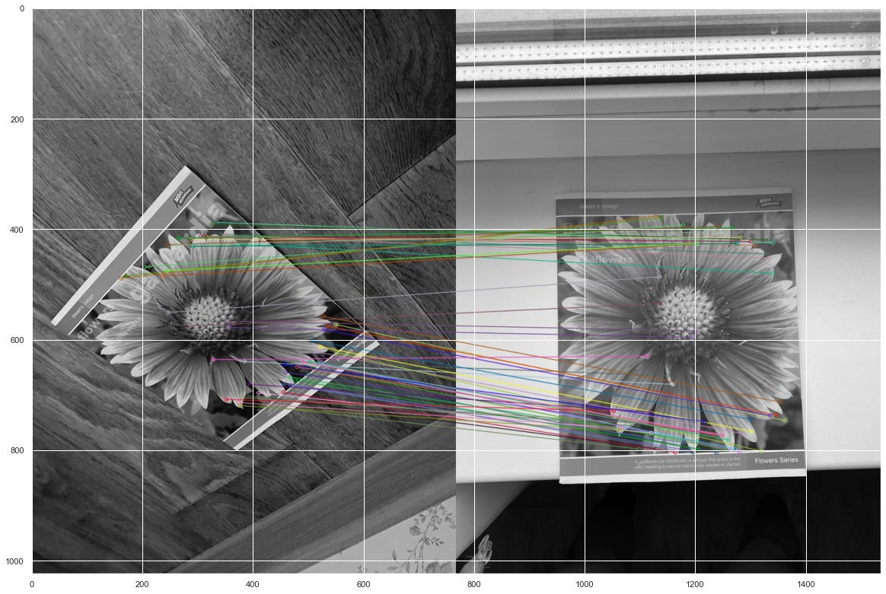
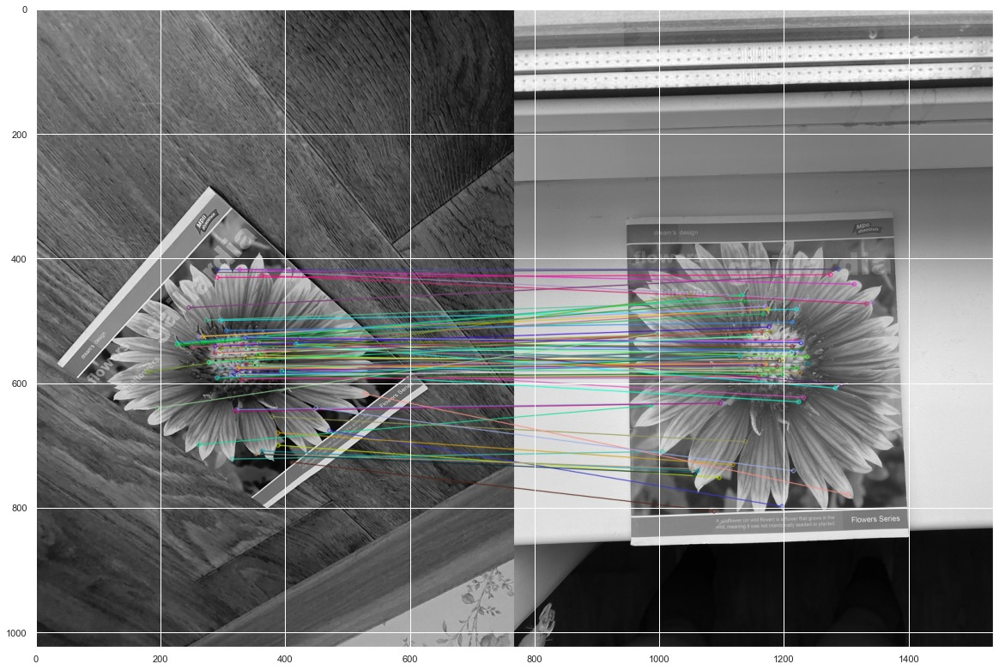

## Lab2

### Brisk and Akaze

### Результати 

### Akaze

### Brisk

### Висновки
1. AKAZE краще за BRISK здатен впоратися з фото поганої якості або тими, що містять шуми, розмитими фото та в цілому точність виявлення є вищою. Він є кращим для зображень зошита.
1. BRISK працює набагато швидше, тому за гарних умов фото його неодмінно можна вважати ефективнішим.
1. BRISK гарно спрацьовує з текстурами, об’ємними зображеннями, він показав себе краще за AKAZE на прикладі машинки.
1. При поворотах чи перекритті зображення обидва дескриптори показують себе добре.
1. Обидва дескриптори краще впоралися з зображеннями плоского предмета.
### Загалом ми очікували гірших результатів ніж отримали під час виконання роботи.

