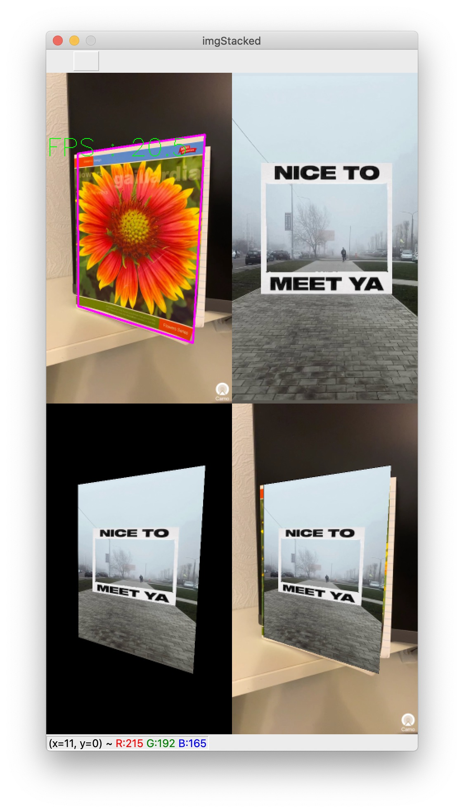

# Lab4

## Result 

### Akaze ~ 20 fps
Навчену модель класифікатора взяли з Лаби 3, додавши пару рядків коду і зберігши у файл, адже так набагато зручніше і використовуємо той самий предмет(зошит): pickle.dump(xgb_model_akaze, open("pima.pickle.dat", "wb"))

### Orb(1000) without clasificator ~ 60 fps

